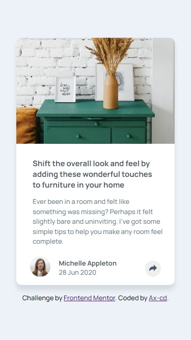
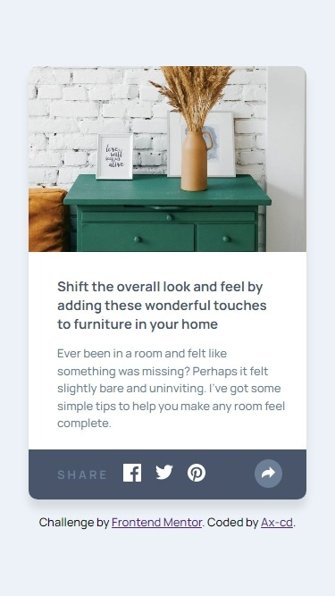
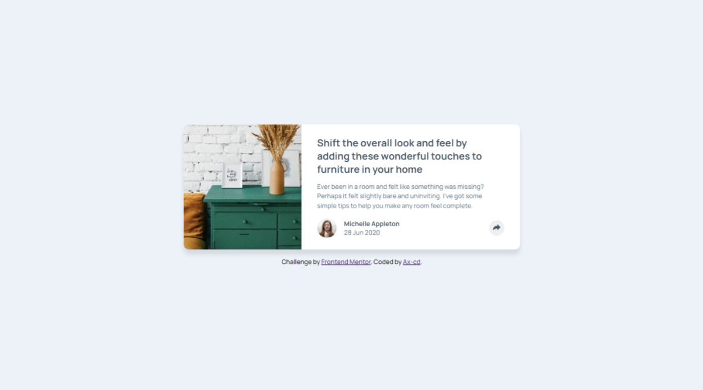
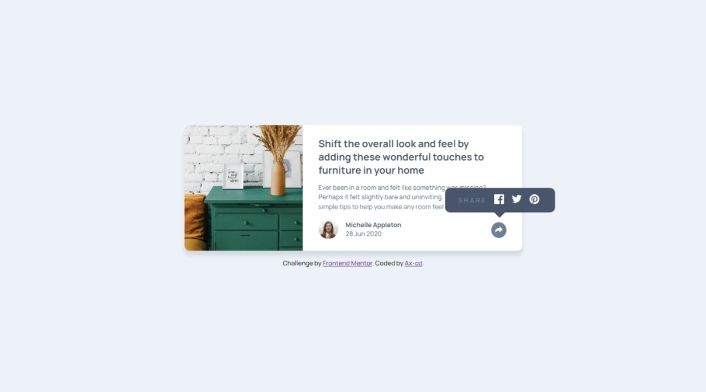

# Frontend Mentor - Article preview component solution

This is a solution to the [Article preview component challenge on Frontend Mentor](https://www.frontendmentor.io/challenges/article-preview-component-dYBN_pYFT). Frontend Mentor challenges help you improve your coding skills by building realistic projects.

## Table of contents

- [Overview](#overview)
  - [The challenge](#the-challenge)
  - [Links](#links)
  - [Screenshot](#screenshot)
    - [Mobile designs](#mobile-designs)
    - [Desktop designs](#desktop-designs)
- [My process](#my-process)
  - [Built with](#built-with)
- [Author](#author)

## Overview

### The challenge

Users should be able to:

- View the optimal layout for the component depending on their device's screen size
- See the social media share links when they click the share icon

### Links

- Solution URL: [Frontend Mentor](https://www.frontendmentor.io/solutions/article-preview-component-with-htmlcssjs-8miI000bFQ)
- Live Site URL: [GitHub Page](https://ax-cd.github.io/article-preview-challenge/)

### Screenshot

#### Mobile designs

#### Desktop designs

## My process

### Built with

- Semantic HTML5 markup
- CSS custom properties
- Flexbox
- Mobile-first workflow

## Author

- GitHub - [Ax-cd](https://github.com/Ax-cd)
- Frontend Mentor - [@Ax-cd](https://www.frontendmentor.io/profile/Ax-cd)
- Instagram - [@ax.coding](https://www.instagram.com/ax.coding/)
